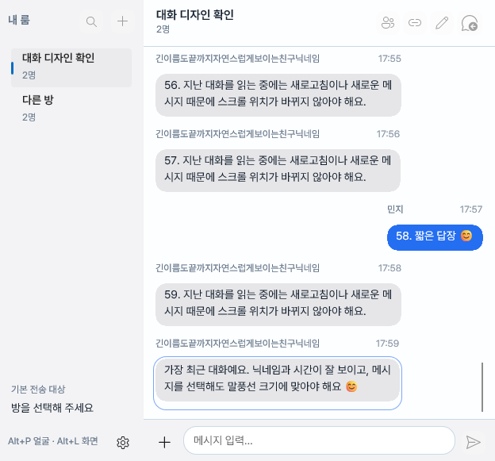
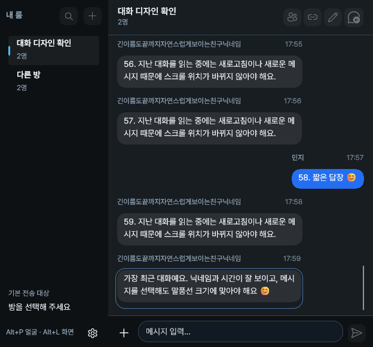
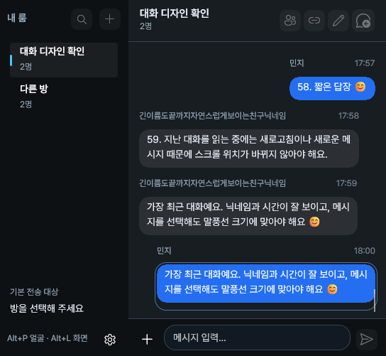

# Windows 0.4.19 채팅 UI 설치 및 요청된 확인

사용자가 2026-10-07 새 설치 파일 생성, 이 PC 설치, 채팅 UI 확인을 명시적으로 요청했다. 이번 요청 범위에서만 패키징과 아래 검사를 수행했다. 일반 코드 수정 후 자동 검증 금지 선호는 유지한다.

## 설치물

- 앱 소스: `1058795`, 버전 변경: `8f9067d`, 브랜치: `codex/windows-parity`.
- [GitHub Actions 37610167240](https://github.com/0mininseoul/ping/actions/runs/37610167240): 두 번째 시도에서 `build_only=true`로 x64/ARM64 패키지와 EXE 생성 성공. 전체 테스트와 일반 smoke suite는 실행하지 않았다.
- 첫 번째 시도는 CI의 Supabase 접속 설정 두 개가 없어 실패했다. 이미 설치된 앱의 pinned Ping 프로젝트 주소와 공개 클라이언트 키를 검사한 후 같은 값으로 빌드용 GitHub secrets를 복원했다. 운영 DB/Auth/API/Storage 설정은 변경하지 않았다.
- 로컬 설치물: `windows/dist/PingSetup-v0.4.19.exe`, 222,974,366 bytes.
- SHA-256: `9EC19F1525D055BF9E99D48414C7DAB7E09AF9C54854A1601DF636A022974339`.
- 기존 CI 인증서와 MSIX 식별자를 유지했다. 외부 EXE의 공인 코드 서명을 새로 추가한 작업은 아니다.

## 이 PC 설치

기존 Ping 프로세스를 종료하고 계정과 설정을 보존 폴더에 백업했다. EXE의 일반 업데이트 설치가 exit 0으로 완료됐고 Windows 등록 버전은 `0.4.19.0`, 상태는 `Ok`였다. 설치 전후 실제/패키지 가상 경로의 Supabase 세션 및 백업 네 개와 빠른 전송 설정 한 개의 파일 해시가 모두 같았다.

대화 창 위치 파일은 기존 사용자 요청에 따라 `\\.\DISPLAY3` 중앙으로 저장했다. 새 설치 경로의 Ping 실행 프로세스와 창 생성을 확인했다. 실사용 계정의 메시지를 새로 보내거나 방/계정/서버 데이터를 삭제하지 않았다.

설치 로그와 보존 비교는 git에 포함하지 않는 `windows/artifacts/ci-37610167240/install/`에 있다.

## 채팅 UI 확인 범위

Ping 창은 Windows 화면 캡처에서 제외되므로 OS 캡처에는 뒤의 창이 나타난다. 이 보호를 변경하지 않았다. 설치된 앱의 실제 대화 화면 전체를 자동으로 관찰했다고 주장하지 않는다.

별도 진단 실행 파일에서 배포 앱과 같은 `HistoryWindow`/`HistoryViewModel`/스타일을 사용해 실제 WinUI 화면을 렌더링했다. 두 방, 60개 샘플 메시지, 긴 한글 닉네임을 사용했고 실제 계정·백엔드·카메라와 연결하지 않았다. 이 실행 경로는 `PING_UI_SMOKE` 조건에만 포함되며 배포 앱에 포함되지 않는다. `--ui-chat-layout-output`를 명시할 때만 이번 검사만 수행한다.

최종 결과 `windows/artifacts/2026-10-07-chat-layout-fixture-03/result.json`에서 다음을 확인했다.

- 최초 방 진입 시 실제 스크롤 끝과 최신 메시지 표시.
- 선택 테두리가 메시지 크기를 따르고 행 전체의 선택 배경은 투명함.
- 긴 한글 닉네임에 말줄임이 없고 줄바꿈 및 글자 높이 여유가 적용됨.
- 변경 없는 새로고침 시 이전 대화 읽기 위치 보존.
- 새 메시지 추가 시 화면에서 읽던 메시지의 위치 보존.
- 다른 방을 열었다가 돌아왔을 때 최신 메시지 표시.
- 최소 창 크기에서 가로 스크롤 넘침 없음.
- 밝은/어두운 테마의 실제 화면 렌더링.

처음 두 검사 시도에서는 목록의 요청/실제 스크롤 offset을 같은 기준으로 비교해 실패했다. 가상 목록은 항목 높이를 재계산하면서 offset/extent를 조정한다. 실제로 읽고 있던 항목의 화면 좌표를 비교하도록 검사 기준을 바로잡았다. 새 메시지 추가 전후 같은 `layout-a-41` 항목의 화면 Y는 `-64`로 같았다. 이 과정에서 앱 동작 코드를 추가로 변경하지 않았다.

## 화면

이미지는 실제 WinUI 컨트롤을 내부 렌더링한 샘플 대화이며 실사용 계정의 대화 스크린샷이 아니다.

실제 계정의 방 진입 및 표시 상태는 사용자가 새 설치 앱에서 직접 관찰할 수 있도록 안내했다.
