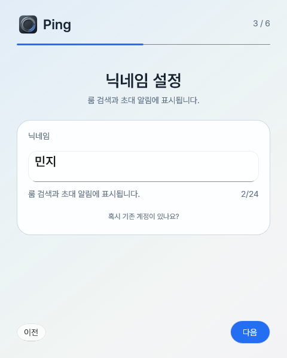
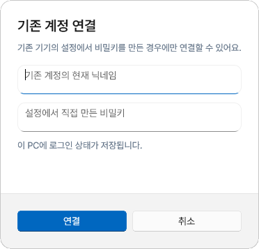
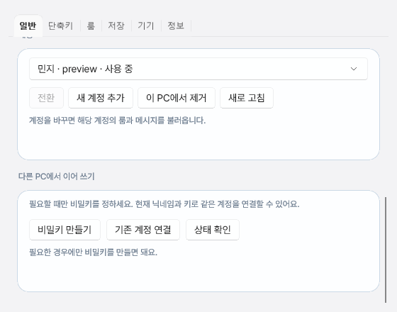
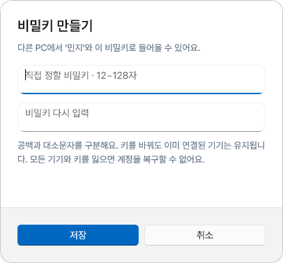
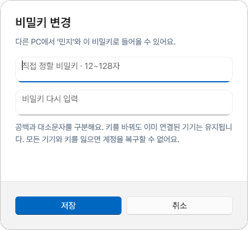

# 선택형 계정 연결 화면

2026-10-07 사용자의 스크린샷 요청에 따라 실제 WinUI 컴포넌트의 화면을 렌더링했다. 예시 닉네임은 `민지`이며 실제 계정·비밀키를 사용하지 않았다. HTML 목업이나 이미지 생성 결과가 아니다.

## 온보딩

기존 닉네임 카드의 설명과 글자 수 아래에 12px 회색 `혹시 기존 계정이 있나요?` 링크를 추가했다. 기본 단계·진행 표시·다음 버튼은 유지한다. 키 생성 단계는 없다.

링크를 누르면 기존 계정의 현재 닉네임과 이미 만들어 둔 키를 입력하는 대화상자가 열린다. PC에 로그인 상태를 저장한다는 문구를 표시한다.

## 설정

일반 탭의 계정 영역 아래에 `다른 PC에서 이어 쓰기` 카드를 추가했다. 필요한 경우에만 키를 만들도록 안내하고, 키 생성/변경·기존 계정 연결·상태 확인 진입점을 제공한다.

키는 직접 입력하고 한 번 더 확인한다. 최소 12~최대 128자, 공백·대소문자 구분, 연결 기기 유지 및 복구 한계를 표시한다. 원문 키를 화면에 일반 텍스트로 표시하거나 자동 생성하지 않는다.

이미 키가 있는 계정에서는 진입점과 제목을 `비밀키 변경`으로 표시한다.

## 표현과 캡처 범위

Pretendard 및 기존 fallback 폰트, 테마에 따라 바뀌는 회색 안내 글씨를 사용한다. 대화상자는 16px 모서리, 입력칸은 10px 모서리와 최소 42px 높이를 사용한다. 대화상자의 안내 색을 전역 테마에서 고정해 읽던 경로를 ThemeResource 스타일로 바꿔 밝은 화면에서도 올바른 회색을 적용했다.

`--ui-account-key-preview <output>`는 진단 전용 빌드에서만 허용한다. production coordinator를 만들지 않고 예시 데이터로 실제 온보딩·설정·대화상자 클래스를 연다. native RenderTargetBitmap으로 PNG를 저장하며 기존 스모크 테스트나 인증·권한·카메라 경로는 실행하지 않는다. 요청된 캡처는 3번 모니터에서 진행했다.

스크린샷 산출물에 필요한 빌드와 화면 렌더링만 수행했다. 로그인/서버/송수신 검증, 일반 테스트·린트·타입 검사·별도 코드 리뷰·검증 CI는 실행하지 않았다. 운영 DB/API 적용 및 새 설치 파일 생성 상태는 여전히 `OPTIONAL_ACCOUNT_KEY_SETUP.ko.md`의 미적용 상태다.
